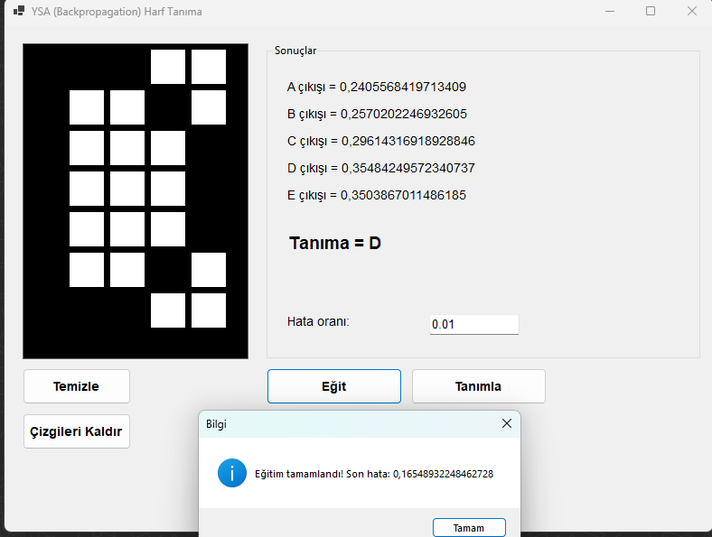

# 🧠 YSA Harf Tanıma Sistemi


> A, B, C, D, E harflerini tanıyan çok katmanlı algılayıcı (MLP) yapay sinir ağı uygulaması



!! Önce Eğitim, Sonra Tanımlayınız.

## 🚀 Özellikler

- **Sıfırdan Yapay Sinir Ağı**: Üçüncü parti kütüphane kullanmadan geliştirilmiş MLP mimarisi
- **İnteraktif Çizim**: 7x5 piksel matris üzerinde fare ile harf çizebilme
- **Geriye Yayılım**: Backpropagation algoritması ile eğitim
- **Gerçek Zamanlı Tanıma**: Anında harf tanıma ve güven skorları
- **Ayarlanabilir Parametreler**: Hata toleransı ve öğrenme hızı düzenlenebilir

## 🏗️ Mimari


Giriş Katmanı (35 nöron) → Gizli Katman (15 nöron) → Çıkış Katmanı (5 nöron)
7x5 piksel Sigmoid aktivasyon A B C D E


### Temel Bileşenler

- **`Neuron.cs`**: Tek nöron implementasyonu, sigmoid aktivasyon fonksiyonu
- **`Layer.cs`**: Nöron katmanı yönetimi ve çıkış hesaplama
- **`NeuralNetwork.cs`**: MLP ağ mimarisi, ileri besleme ve geriye yayılım
- **`DataProvider.cs`**: Eğitim verisi sağlayıcı, harf desenleri
- **`Form1.cs`**: Windows Forms kullanıcı arayüzü

## 📊 Algoritma Detayları

### İleri Besleme (Forward Propagation)

Input(35) → Hidden Layer(15) → Output Layer(5) → Prediction

### Geriye Yayılım (Backpropagation)

Error Calculation → Weight Update → Bias Update → Learning Rate Application


## 🎮 Kullanım

1. **Eğitim**: "Eğit" butonuna basarak ağı önceden tanımlanmış harf desenleriyle eğitin
2. **Çizim**: Sol paneldeki 7x5 matris üzerinde tanımak istediğiniz harfi çizin
3. **Tanıma**: "Tanımla" butonuna basarak sonucu görün

### Hata Toleransı Ayarlama
- Düşük epsilon (0.001): Daha hassas tanıma, uzun eğitim süresi
- Yüksek epsilon (0.1): Hızlı eğitim, daha az hassas tanıma

## 🛠️ Kurulum ve Çalıştırma

### Gereksinimler
- .NET 8.0 Runtime
- Windows 10/11
- Visual Studio 2022 (geliştirme için)

### Kurulum
```bash
git clone https://github.com/akilkalpitifaki/yapay-sinir-agi-harf-tanima.git
cd yapay-sinir-agi-harf-tanima
dotnet build
dotnet run
```

## 📈 Teknik Detaylar

- **Giriş Boyutu**: 35 (7×5 piksel matris)
- **Gizli Katman**: 15 nöron
- **Çıkış Boyutu**: 5 (A, B, C, D, E)
- **Aktivasyon**: Sigmoid fonksiyonu
- **Öğrenme Algoritması**: Gradient Descent + Backpropagation
- **Varsayılan Öğrenme Hızı**: 0.1

## 🎯 Eğitim Verisi

Her harf için 7×5 piksel matris formatında önceden tanımlanmış desenler.
